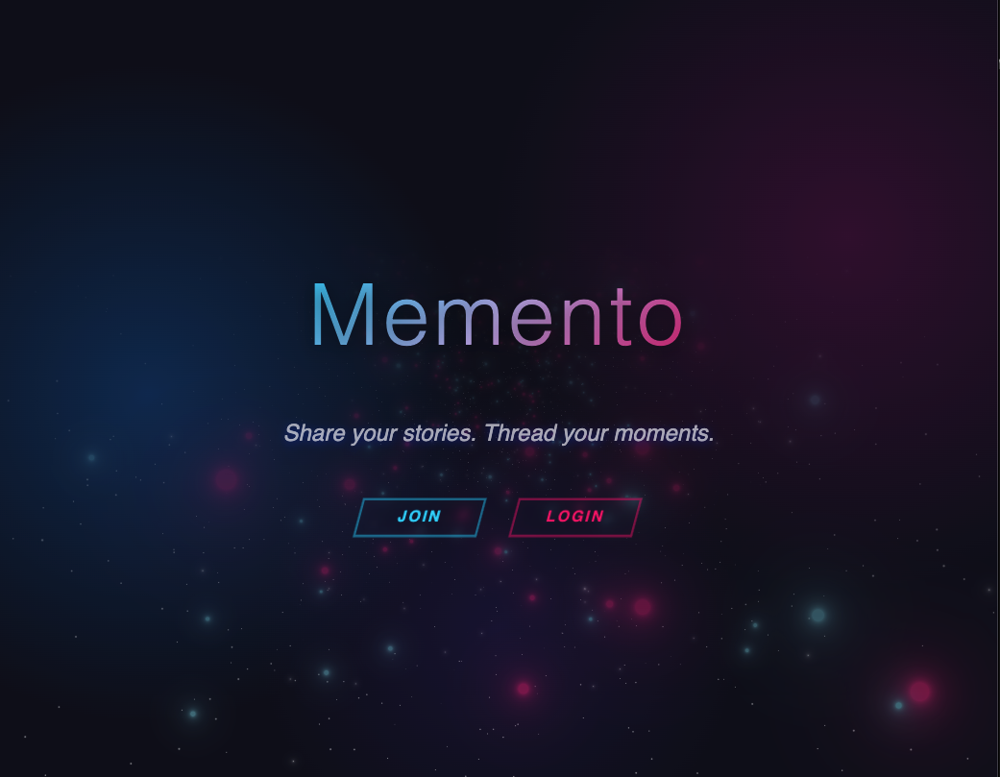
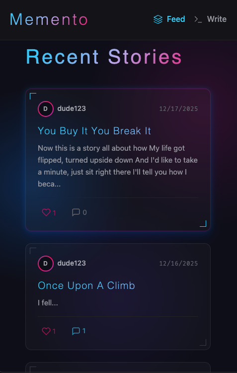
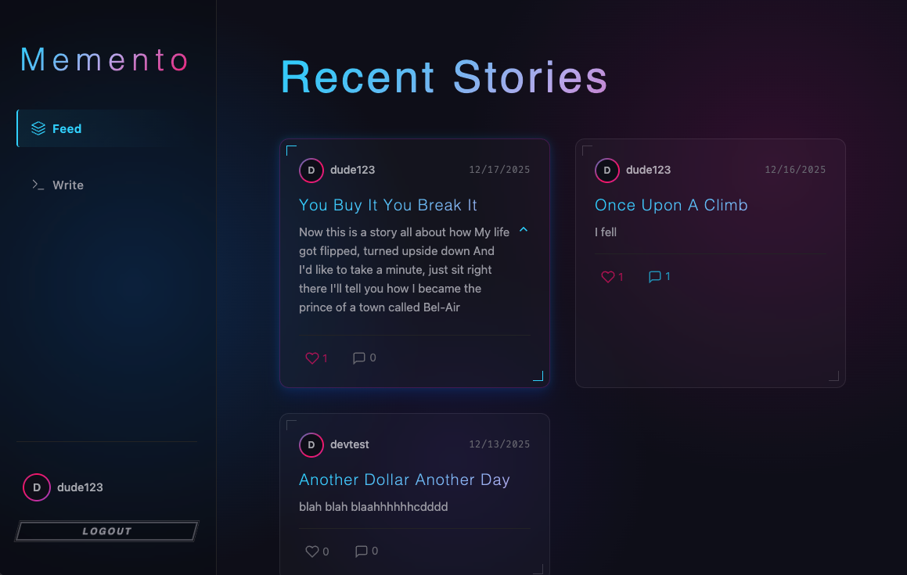
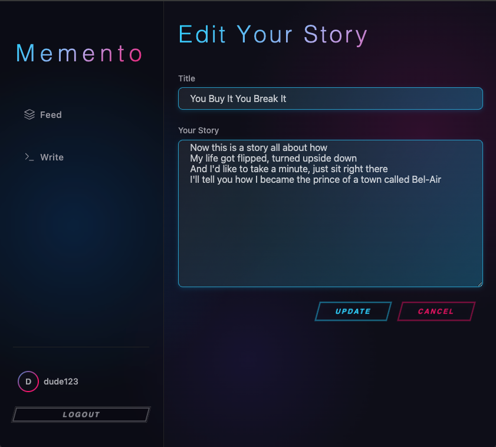
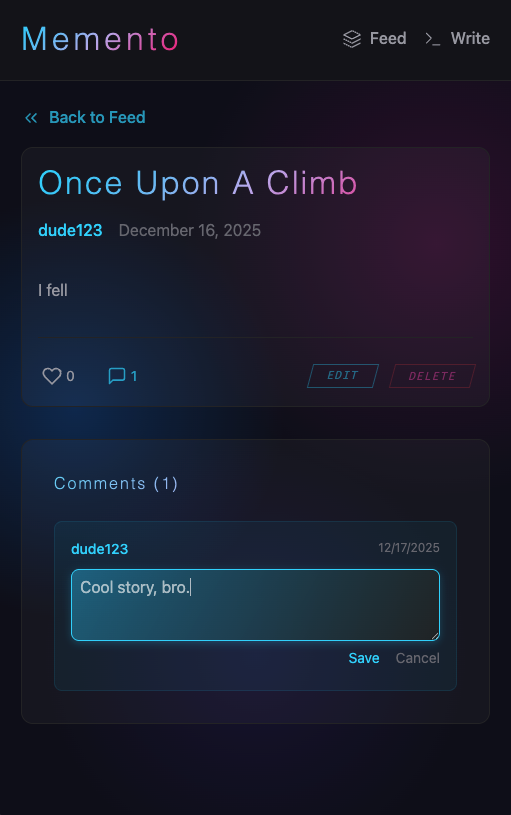
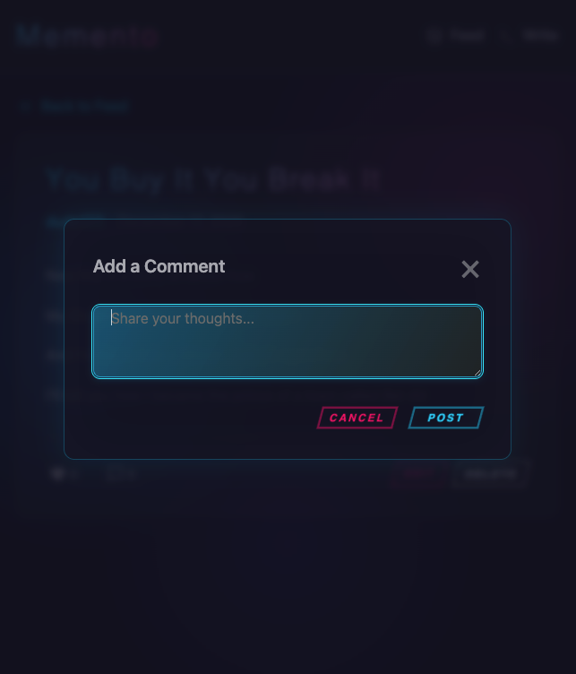

# Memento — Frontend

Share your stories. Thread your moments.

## Screenshots

|                    Landing Page                     |                   Mobile Feed                    |
| :-------------------------------------------------: | :----------------------------------------------: |
|  |  |

|                  Expanded Story Card                  |                 Story Detail                 |
| :---------------------------------------------------: | :------------------------------------------: |
|  |  |

|                 Edit Story                  |                     Edit Comment                     |
| :-----------------------------------------: | :--------------------------------------------------: |
|  |  |

|               Add Comment               |
| :-------------------------------------: |
|  |

## About

Memento is a story-sharing web app where users can sign up, create stories, explore a feed, like posts, and join conversations through comments. This repository contains the React (Vite) frontend, including authentication, protected routes, and a visually rich landing experience powered by 3D/particles.

## Table of Contents

- [Core Feature](#core-features)
- [Getting Started](#getting-started)
- [Local Development](#local-development)
- [Technologies Used](#technologies-used)
- [Project Structure](#project-structure)
- [Scripts](#scripts)
- [Attributions](#attributions)

## Core Features

- Authentication: signup, login, token persistence, and logout
- Protected routes and gated content
- Story feed: list, view detail, create, edit, delete
- Likes on stories with live UI updates
- Comments: view, add, and delete per story
- 3D/particles landing visuals using React Three Fiber, Drei, and tsParticles

## Getting Started

- [Trello Board](https://trello.com/b/M28zGGxz/memento-blog)
- [Memento Backend](https://github.com/colinw10/memento-backend.git)

## Local Development

To run this project locally:

1. Clone the repository
   ```bash
   git clone https://github.com/colinw10/memento-frontend.git
   cd memento-frontend
   ```
2. Install dependencies
   ```bash
   npm install
   ```
3. Create `.env`
   - The frontend expects an API base at `VITE_API_URL`.
   - Recommended for local dev (matches services using `/stories`, `/auth`, etc.):
     ```bash
     # .env
     VITE_API_URL=http://localhost:3000/api
     ```
   - Note: `vite.config.js` proxies `/api` to `http://localhost:3000`. Ensure your backend runs there.
4. Start development server
   ```bash
   npm run dev
   ```
5. Open the app in your browser
   - http://localhost:5173

## Technologies Used

- Frontend: React 18, Vite 5, React Router 6, Axios
- Visuals: Three.js, @react-three/fiber, @react-three/drei, tsParticles
- Development: Node.js (LTS), npm
- Backend: Exposed under `VITE_API_URL` (see backend repo link above)

## Project Structure

```
.
├─ index.html
├─ package.json
├─ vite.config.js
├─ README.md
├─ docs/
│  ├─ TEAM-README.md
│  └─ TEAM_NOTES/
│     ├─ landing-update.md
│     └─ team-plan/
│        ├─ cristal.md
│        ├─ pablo.md
│        ├─ tito.md
│        └─ pablo-crystal/styling-updates.md
├─ src/
│  ├─ main.jsx
│  ├─ App.jsx
│  ├─ context/
│  │  └─ AuthContext.jsx
│  ├─ components/
│  │  ├─ ProtectedRoute.jsx
│  │  ├─ CommentSection.jsx
│  │  ├─ Navbar/
│  │  │  ├─ Navbar.jsx
│  │  │  └─ Navbar.css
│  │  └─ StoryCard/
│  │     ├─ StoryCard.jsx
│  │     └─ StoryCard.css
│  ├─ pages/
│  │  ├─ Landing/
│  │  │  ├─ Landing.jsx
│  │  │  └─ Landing.css
│  │  ├─ Home/
│  │  │  ├─ Home.jsx
│  │  │  └─ Home.css
│  │  ├─ Login/
│  │  │  ├─ Login.jsx
│  │  │  └─ Login.css
│  │  ├─ Signup/
│  │  │  ├─ Signup.jsx
│  │  │  └─ Signup.css
│  │  ├─ CreateStory/
│  │  │  ├─ CreateStory.jsx
│  │  │  └─ CreateStory.css
│  │  └─ StoryDetail/
│  │     ├─ StoryDetail.jsx
│  │     └─ StoryDetail.css
│  ├─ services/
│  │  ├─ api.js
│  │  ├─ authService.js
│  │  ├─ storyService.js
│  │  └─ commentService.js
│  └─ styles/
│     ├─ global.css
│     └─ variables.css
└─ temp_auth.js
```

## Scripts

- `npm run dev`: Start development server
- `npm run build`: Build for production
- `npm run preview`: Preview production build

## Attributions

- Visuals powered by Three.js, @react-three/fiber, and @react-three/drei
- Particle effects by tsParticles and @tsparticles/react

## Developed By

- Pablo Cordero
- Colin Weir
- Natalia Pricop
- Cristal Ruiz
- Tito Del Valle

For team assignments and task details, see [docs/TEAM-README.md](docs/TEAM-README.md).
